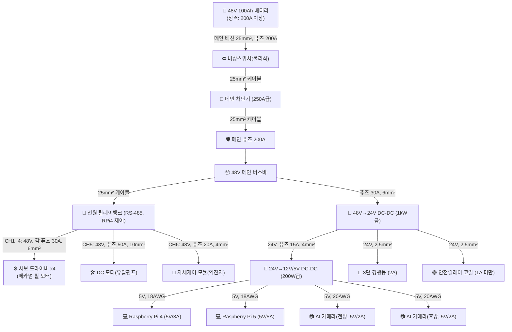

# 고소작업자 개발 노트

> **생성일:** 2025-09-29T02:57:00.000Z
> **수정일:** 2025-09-29T05:25:00.000Z

## 안전사양

```mermaid
flowchart TD
    %% POWER SOURCE
    BATT["🔋 48V 100Ah 배터리\n(정격: 200A 이상)"] -->|메인 배선 25mm², 퓨즈 200A| EMG["⛔ 비상스위치(물리식)"]
    EMG -->|25mm² 케이블| MCB["🔌 메인 차단기 (250A급)"]
    MCB -->|25mm² 케이블| FUSE["🛡 메인 퓨즈 200A"]
    FUSE --> BUS["📦 48V 메인 버스바"]

    %% RELAY BANK
    BUS -->|25mm² 케이블| RELAYBANK["🔲 전원 릴레이뱅크 (RS-485, RPi4 제어)"]

    %% RELAY OUTPUT CHANNELS
    RELAYBANK -->|CH1~4: 48V, 각 퓨즈 30A, 6mm²| SERVO["⚙️ 서보 드라이버 x4\n(메카넘 휠 모터)"]
    RELAYBANK -->|CH5: 48V, 퓨즈 50A, 10mm²| HYDRAULIC["🛠 DC 모터(유압펌프)"]
    RELAYBANK -->|CH6: 48V, 퓨즈 20A, 4mm²| POSTURE["📐 자세제어 모듈(역진자)"]

    %% DC-DC BRANCH
    BUS -->|퓨즈 30A, 6mm²| DCDC48_24["🔻 48V→24V DC-DC (1kW급)"]
    DCDC48_24 -->|24V, 퓨즈 15A, 4mm²| DCDC24_5["🔻 24V→12V/5V DC-DC (200W급)"]

    %% LOW VOLTAGE LOADS
    DCDC48_24 -->|24V, 2.5mm²| BEACON["🚨 3단 경광등 (2A)"]
    DCDC48_24 -->|24V, 2.5mm²| SAFETY["🟢 안전릴레이 코일 (1A 미만)"]

    DCDC24_5 -->|5V, 18AWG| RPI4["💻 Raspberry Pi 4 (5V/3A)"]
    DCDC24_5 -->|5V, 18AWG| RPI5["💻 Raspberry Pi 5 (5V/5A)"]
    DCDC24_5 -->|5V, 20AWG| CAMERA1["📷 AI 카메라(전방, 5V/2A)"]
    DCDC24_5 -->|5V, 20AWG| CAMERA2["📷 AI 카메라(후방, 5V/2A)"]
```