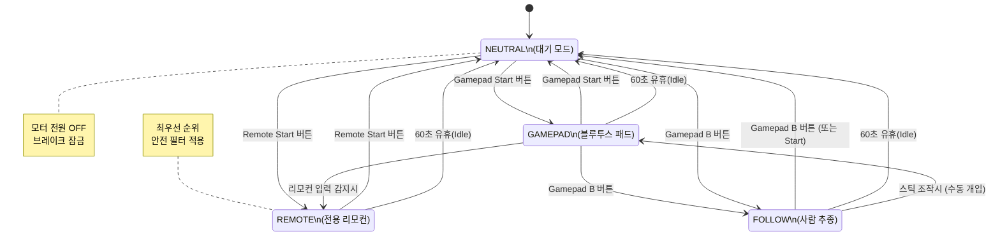
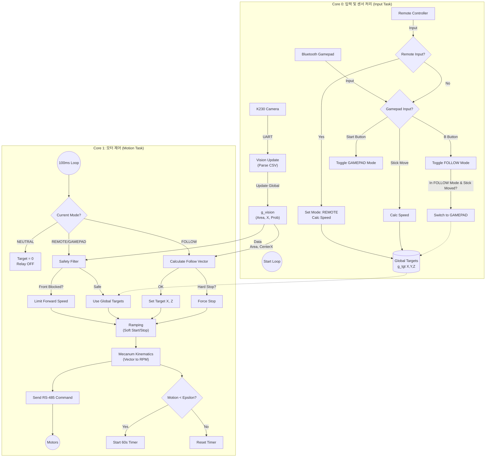

# 메카넘 플렛폼 제어 로직 다이어그램 1.06v

> **생성일:** 2025-11-20T06:50:00.000Z
> **수정일:** 2025-11-20T06:54:00.000Z

```mermaid
stateDiagram-v2
    [*] --> NEUTRAL
    
    state "NEUTRAL\n(대기 모드)" as NEUTRAL
    state "REMOTE\n(전용 리모컨)" as REMOTE
    state "GAMEPAD\n(블루투스 패드)" as GAMEPAD
    state "FOLLOW\n(사람 추종)" as FOLLOW

    note right of NEUTRAL
        모터 전원 OFF
        브레이크 잠금
    end note

    note left of REMOTE
        최우선 순위
        안전 필터 적용
    end note

    %% 리모컨 전원/스타트 버튼
    NEUTRAL --> REMOTE : Remote Start 버튼
    REMOTE --> NEUTRAL : Remote Start 버튼

    %% 게임패드 Start 버튼
    NEUTRAL --> GAMEPAD : Gamepad Start 버튼
    GAMEPAD --> NEUTRAL : Gamepad Start 버튼

    %% 게임패드 B 버튼
    GAMEPAD --> FOLLOW : Gamepad B 버튼
    FOLLOW --> NEUTRAL : Gamepad B 버튼 (또는 Start)
    NEUTRAL --> FOLLOW : Gamepad B 버튼

    %% 자동 복귀 조건
    REMOTE --> NEUTRAL : 60초 유휴(Idle)
    GAMEPAD --> NEUTRAL : 60초 유휴(Idle)
    FOLLOW --> NEUTRAL : 60초 유휴(Idle)
    
    %% 우선순위 인터럽트
    GAMEPAD --> REMOTE : 리모컨 입력 감지시
    FOLLOW --> GAMEPAD : 스틱 조작시 (수동 개입)

```

```mermaid
flowchart TD
    subgraph Core0 ["Core 0: 입력 및 센서 처리 (Input Task)"]
        direction TB
        InputStart((Start Loop))
        
        %% 입력 소스
        RC[Remote Controller]
        GP[Bluetooth Gamepad]
        Cam[K230 Camera]

        %% Vision 처리 (따옴표 추가)
        Cam -->|UART| VisionUpdate["Vision Update\n(Parse CSV)"]
        VisionUpdate -->|Update Global| G_Vision["g_vision\n(Area, X, Prob)"]
        
        %% 입력 처리 및 모드 결정
        RC -->|Input| CheckRC{Remote Input?}
        GP -->|Input| CheckGP{Gamepad Input?}
        
        CheckRC -- Yes --> SetRemote["Set Mode: REMOTE\nCalc Speed"]
        CheckRC -- No --> CheckGP
        
        CheckGP -- B Button --> ToggleFollow[Toggle FOLLOW Mode]
        CheckGP -- Start Button --> ToggleGame[Toggle GAMEPAD Mode]
        CheckGP -- Stick Move --> CalcStick[Calc Speed]
        
        %% 추종 모드 수동 개입
        ToggleFollow -->|"In FOLLOW Mode & Stick Moved?"| Override[Switch to GAMEPAD]
        
        %% 데이터 공유
        SetRemote --> GlobalVars[("Global Targets\ng_tgt X,Y,Z")]
        CalcStick --> GlobalVars
    end

    subgraph Core1 ["Core 1: 모터 제어 (Motion Task)"]
        direction TB
        MotionStart((100ms Loop))
        
        %% 모드 확인
        MotionStart --> CheckMode{Current Mode?}
        
        %% 1. NEUTRAL
        CheckMode -- NEUTRAL --> StopMotors["Target = 0\nRelay OFF"]
        
        %% 2. REMOTE / GAMEPAD
        CheckMode -- REMOTE/GAMEPAD --> SafetyCheck[Safety Filter]
        G_Vision -->|Data| SafetyCheck
        SafetyCheck -->|"Front Blocked?"| LimitSpeed[Limit Forward Speed]
        SafetyCheck -->|Safe| PassTarget[Use Global Targets]
        
        %% 3. FOLLOW
        CheckMode -- FOLLOW --> VisionCalc[Calculate Follow Vector]
        G_Vision -->|"Area, CenterX"| VisionCalc
        VisionCalc -->|"Hard Stop?"| EmergStop[Force Stop]
        VisionCalc -->|OK| SetFollowTgt[Set Target X, Z]
        
        %% 공통 모터 제어
        LimitSpeed --> Ramping
        PassTarget --> Ramping
        SetFollowTgt --> Ramping
        EmergStop --> Ramping["Ramping\n(Soft Start/Stop)"]
        
        Ramping --> Kinematics["Mecanum Kinematics\n(Vector to RPM)"]
        Kinematics --> RS485[Send RS-485 Command]
        RS485 --> Motors((Motors))
        
        %% 유휴 타이머
        Kinematics --> CheckIdle{"Motion < Epsilon?"}
        CheckIdle -- Yes --> TimerOn[Start 60s Timer]
        CheckIdle -- No --> TimerOff[Reset Timer]
    end

    %% Core 간 연결
    GlobalVars -.-> PassTarget
    Override -.-> GlobalVars
```