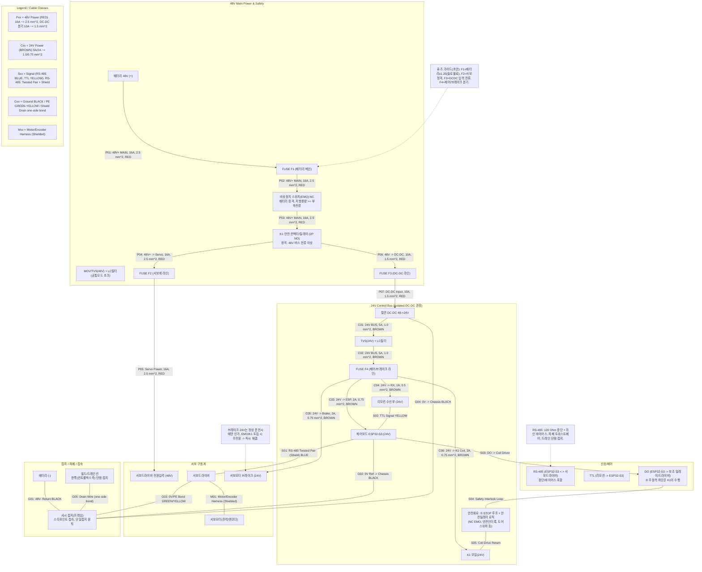

# 지게차 메카넘휠 컨트롤 박스 배선

> **생성일:** 2025-11-07T05:22:00.000Z
> **수정일:** 2025-12-19T03:06:00.000Z

## 메카넘휠 플렛폼 제작을 위한 배선도 설정

```mermaid
flowchart TB
  %% =================== POWER: 48V BUS + SAFETY ===================
  subgraph P48["48V Main Power & Safety"]
    BATT["배터리 48V (+)"]
    F1["FUSE F1 (배터리 메인)"]
    EMO_BTN["비상정지 스위치(EMO) NC<br/>배터리 정격, 저항용량 >= 부하전류"]
    K1_CNT["K1 안전 컨택터/릴레이 (2P NO)<br/>정격: 48V 버스 전류 이상"]
    MOV48["MOV/TVS(48V) + LC필터(공통모드 초크)"]
    F2["FUSE F2 (서보계 라인)"]
    F3["FUSE F3 (DC-DC 라인)"]
  end

  %% =================== 24V CONTROL BUS ===================
  subgraph P24["24V Control Bus (Isolated DC-DC 권장)"]
    DCDC["절연 DC-DC 48->24V"]
    MOV24["TVS(24V) + LC필터"]
    F4["FUSE F4 (제어/브레이크 라인)"]
    ESP["제어보드 ESP32-S3 (24V)"]
    RX["리모컨 수신부 (24V)"]
    K1_COIL["K1 코일(24V)"]
    K1_COIL_DRIVE["안전회로: E-STOP 루프 + 안전릴레이 로직<br/>(NC EMO, 안전인터록, 도어스위치 등)"]
  end

  %% =================== DRIVE TRAIN ===================
  subgraph DRIVE["서보 구동계"]
    SD_PWR["서보드라이버 전원입력 (48V)"]
    SD["서보드라이버"]
    SM["서보모터(전력/엔코더)"]
    BRAKE["서보모터 브레이크 (24V)"]
  end

  %% =================== SIGNALS ===================
  subgraph SIG["신호/제어"]
    RS485["RS-485 (ESP32-S3 <-> 서보드라이버)<br/>종단/바이어스 포함"]
    TTL["TTL (리모컨 -> ESP32-S3)"]
    DO["DO (ESP32-S3 -> 보조 릴레이/드라이버)<br/>※ 주동력 차단은 K1이 수행"]
  end

  %% =================== GROUND / CHASSIS ===================
  subgraph GND["접지 / 차폐 / 접속"]
    CHASSIS["샤시 접지(프레임)<br/>스타포인트 접속, 단일접지 원칙"]
    BNEG["배터리 (-)"]
    SHIELD["쉴드/드레인선<br/>한쪽(컨트롤박스측) 단점 접지"]
  end

  %% ---------- 48V MAIN FLOW ----------
  BATT -->|"P01: 48V+ MAIN, 16A, 2.5 mm^2, RED"| F1
  F1 -->|"P02: 48V+ MAIN, 16A, 2.5 mm^2, RED"| EMO_BTN
  EMO_BTN -->|"P03: 48V+ MAIN, 16A, 2.5 mm^2, RED"| K1_CNT
  K1_CNT -->|"P04: 48V+ -> Servo, 16A, 2.5 mm^2, RED"| F2
  F2 -->|"P05: Servo Power, 16A, 2.5 mm^2, RED"| SD_PWR
  K1_CNT -->|"P06: 48V -> DC-DC, 10A, 1.5 mm^2, RED"| F3
  F3 -->|"P07: DC-DC Input, 10A, 1.5 mm^2, RED"| DCDC

  %% ---------- 24V BUS ----------
  DCDC -->|"C01: 24V BUS, 5A, 1.0 mm^2, BROWN"| MOV24
  MOV24 -->|"C02: 24V BUS, 5A, 1.0 mm^2, BROWN"| F4
  F4 -->|"C03: 24V -> ESP, 2A, 0.75 mm^2, BROWN"| ESP
  F4 -->|"C04: 24V -> RX, 1A, 0.5 mm^2, BROWN"| RX
  F4 -->|"C05: 24V -> Brake, 2A, 0.75 mm^2, BROWN"| BRAKE
  F4 -->|"C06: 24V -> K1 Coil, 2A, 0.75 mm^2, BROWN"| K1_COIL

  %% ---------- SERVO ----------
  SD ---|"M01: Motor/Encoder Harness (Shielded)"| SM

  %% ---------- SIGNALS ----------
  ESP ---|"S01: RS-485 Twisted Pair (Shield) BLUE"| SD
  RX ---|"S02: TTL Signal YELLOW"| ESP
  ESP -->|"S03: DO -> Coil Driver"| DO
  DO ---|"S04: Safety Interlock Loop"| K1_COIL_DRIVE
  K1_COIL_DRIVE ---|"S05: Coil Drive Return"| K1_COIL

  %% ---------- GROUND / EMC ----------
  BNEG ---|"G01: 48V- Return BLACK"| CHASSIS
  ESP ---|"G02: 0V Ref -> Chassis BLACK"| CHASSIS
  SD ---|"G03: 0V/PE Bond GREEN/YELLOW"| CHASSIS
  DCDC ---|"G04: 0V -> Chassis BLACK"| CHASSIS
  SHIELD ---|"G05: Drain Wire (one-side bond)"| CHASSIS

  %% ---------- LEGEND ----------
  subgraph LEGEND["Legend / Cable Classes"]
    L1["Pxx = 48V Power (RED) 16A ~= 2.5 mm^2, DC-DC 분기 10A ~= 1.5 mm^2"]
    L2["Cxx = 24V Power (BROWN) 5A/2A ~= 1.0/0.75 mm^2"]
    L3["Sxx = Signal (RS-485 BLUE, TTL YELLOW). RS-485: Twisted Pair + Shield"]
    L4["Gxx = Ground BLACK / PE GREEN-YELLOW / Shield Drain one-side bond"]
    L5["Mxx = Motor/Encoder Harness (Shielded)"]
  end

  %% ---------- NOTES ----------
  N1["퓨즈 가이드(초안): F1=배터리x1.25(슬로블로), F2=서보 정격, F3=DCDC 입력 전류, F4=제어/브레이크 분기."]
  N2["RS-485: 120 Ohm 종단 + 라인 바이어스, 차폐 트위스트페어, 드레인 단점 접지."]
  N3["브레이크 24V는 정상 운전시에만 인가, EMO/K1 트립 시 무전원 -> 즉시 체결."]
  N1 -.-> F1
  N2 -.-> RS485
  N3 -.-> BRAKE
```